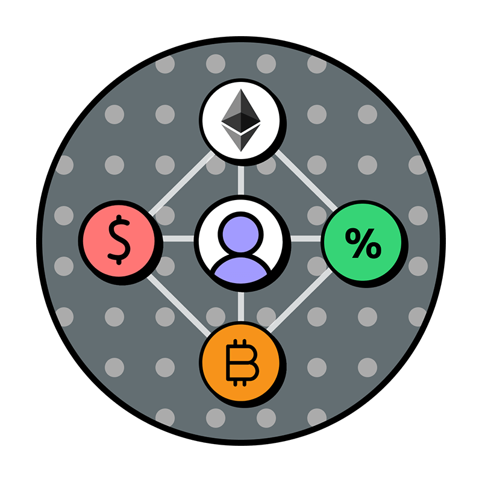

<div id="top"></div>

<!-- PROJECT SHIELDS -->
<!--
*** I'm using markdown "reference style" links for readability.
*** Reference links are enclosed in brackets [ ] instead of parentheses ( ).
-->

<!-- PROJECT LOGO -->
<br />
<div align="center">
  <a href="https://github.com/agad98/My_FullStack-DeFi_App">
    
  </a>

<h3 align="center">Full Stack Defi app</h3>

  <p align="center">
    Just a regular Full Stack Defi app using Solidity, Brownie and React 
    <br />
    <a href="https://github.com/agad98/My_FullStack-DeFi_App"><strong>Explore the docs »</strong></a>
    <br />
    <br />
    <a href="https://github.com/agad98/My_FullStack-DeFi_App">View Demo</a>
    ·
    <a href="https://github.com/agad98/My_FullStack-DeFi_App/issues">Report Bug</a>
    ·
    <a href="https://github.com/agad98/My_FullStack-DeFi_App/issues">Request Feature</a>
  </p>
</div>


<!-- TABLE OF CONTENTS -->
<details>
  <summary>Table of Contents</summary>
  <ol>
    <li>
      <a href="#about-the-project">About The Project</a>
      <ul>
        <li><a href="#built-with">Built With</a></li>
      </ul>
    </li>
    <li>
      <a href="#getting-started">Getting Started</a>
      <ul>
        <li><a href="#prerequisites">Prerequisites</a></li>
        <li><a href="#installation">Installation</a></li>
      </ul>
    </li>
    <li><a href="#usage">Usage</a></li>
    <li><a href="#roadmap">Roadmap</a></li>
    <li><a href="#contributing">Contributing</a></li>
    <li><a href="#license">License</a></li>
    <li><a href="#contact">Contact</a></li>
    <li><a href="#acknowledgments">Acknowledgments</a></li>
  </ol>
</details>


<!-- ABOUT THE PROJECT -->
## About The Project

[![Product Name Screen Shot][product-screenshot]]


<p align="right">(<a href="#top">back to top</a>)</p>


### Built With

* [React.js](https://reactjs.org/)
* [Solidity](https://docs.soliditylang.org/)
* [Brownie](https://eth-brownie.readthedocs.io/)
* [Python](https://www.python.org/doc/)

<p align="right">(<a href="#top">back to top</a>)</p>


<!-- GETTING STARTED -->
## Getting Started

This is a full stack defi staking application for yield farming, borrowing and lending, or any other use.

### Prerequisites

Please install or have installed the following:

- [nodejs and npm](https://nodejs.org/en/download/)
- [python](https://www.python.org/downloads/)

### Installation

1. [Install Brownie](https://eth-brownie.readthedocs.io/en/stable/install.html). Here is a simple way to install brownie.

```bash
pip install --user pipx
pipx ensurepath
# restart your terminal
pipx install eth-brownie
```
Or if you can't get `pipx` to work, via pip (it's recommended to use pipx)
```bash
pip install eth-brownie
```

2. Clone this repo
```
git clone https://github.com/agad98/My_FullStack-DeFi_App
cd defi-stake-yield-brownie
```

1. [Install ganache-cli](https://www.npmjs.com/package/ganache-cli)

```bash
npm install -g ganache-cli
```

If you want to be able to deploy to testnets, do the following. 

4. Set your environment variables

Set your `WEB3_INFURA_PROJECT_ID`, and `PRIVATE_KEY` [environment variables](https://www.twilio.com/blog/2017/01/how-to-set-environment-variables.html). 

You can get a `WEB3_INFURA_PROJECT_ID` by getting a free trial of [Infura](https://infura.io/). At the moment, it does need to be infura with brownie. You can find your `PRIVATE_KEY` from your ethereum wallet like [metamask](https://metamask.io/). 

You'll also need testnet rinkeby or Kovan ETH and LINK. You can get LINK and ETH into your wallet by using the [rinkeby faucets located here](https://docs.chain.link/docs/link-token-contracts#rinkeby). If you're new to this, [watch this video.](https://www.youtube.com/watch?v=P7FX_1PePX0)

You'll also want an [Etherscan API Key](https://etherscan.io/apis) to verify your smart contracts. 

You can add your environment variables to the `.env` file:
```bash
export WEB3_INFURA_PROJECT_ID=<PROJECT_ID>
export PRIVATE_KEY=<PRIVATE_KEY>
export ETHERSCAN_TOKEN=<YOUR_TOKEN>
```
> DO NOT SEND YOUR KEYS TO GITHUB
> If you do that, people can steal all your funds.

<p align="right">(<a href="#top">back to top</a>)</p>


<!-- USAGE EXAMPLES -->
## Usage

```bash
brownie run scripts/deploy.py
```
This will deploy the contracts, depoly some mock Chainlink contracts for you to interact with.
```bash
brownie run scripts/deploy.py --network kovan
```
This will do the same thing... but on Kovan.

## Front end
```bash
cd front_end
yarn
yarn start
```
and you'll be able to interact with the UI

<p align="right">(<a href="#top">back to top</a>)</p>


<!-- ROADMAP -->
## Roadmap

- [x] stakeTokens
- [x] unStakeTokens
- [x] getUserTotalValue
    - [x] issueTokens

See the [open issues](https://github.com/agad98/My_FullStack-DeFi_App) for a full list of proposed features (and known issues).

<p align="right">(<a href="#top">back to top</a>)</p>


<!-- LICENSE -->
## License

Distributed under the MIT License. See `LICENSE.txt` for more information.

<p align="right">(<a href="#top">back to top</a>)</p>


<!-- CONTACT -->
## Contact

Your Name - [@twitter_handle](https://twitter.com/therealGVD) - ahmedgad@tamu.edu

Project Link: [https://github.com/agad98/My_FullStack-DeFi_App](https://github.com/agad98/My_FullStack-DeFi_App)

<p align="right">(<a href="#top">back to top</a>)</p>


<!-- MARKDOWN LINKS & IMAGES -->
<!-- https://www.markdownguide.org/basic-syntax/#reference-style-links -->
[contributors-shield]: https://img.shields.io/github/contributors/github_username/repo_name.svg?style=for-the-badge
[contributors-url]: https://github.com/github_username/repo_name/graphs/contributors
[forks-shield]: https://img.shields.io/github/forks/github_username/repo_name.svg?style=for-the-badge
[forks-url]: https://github.com/github_username/repo_name/network/members
[stars-shield]: https://img.shields.io/github/stars/github_username/repo_name.svg?style=for-the-badge
[stars-url]: https://github.com/github_username/repo_name/stargazers
[issues-shield]: https://img.shields.io/github/issues/github_username/repo_name.svg?style=for-the-badge
[issues-url]: https://github.com/github_username/repo_name/issues
[license-shield]: https://img.shields.io/github/license/github_username/repo_name.svg?style=for-the-badge
[license-url]: https://github.com/github_username/repo_name/blob/master/LICENSE.txt
[linkedin-shield]: https://img.shields.io/badge/-LinkedIn-black.svg?style=for-the-badge&logo=linkedin&colorB=555
[linkedin-url]: https://linkedin.com/in/linkedin_username
[product-screenshot]: images/screenshot.jpg
